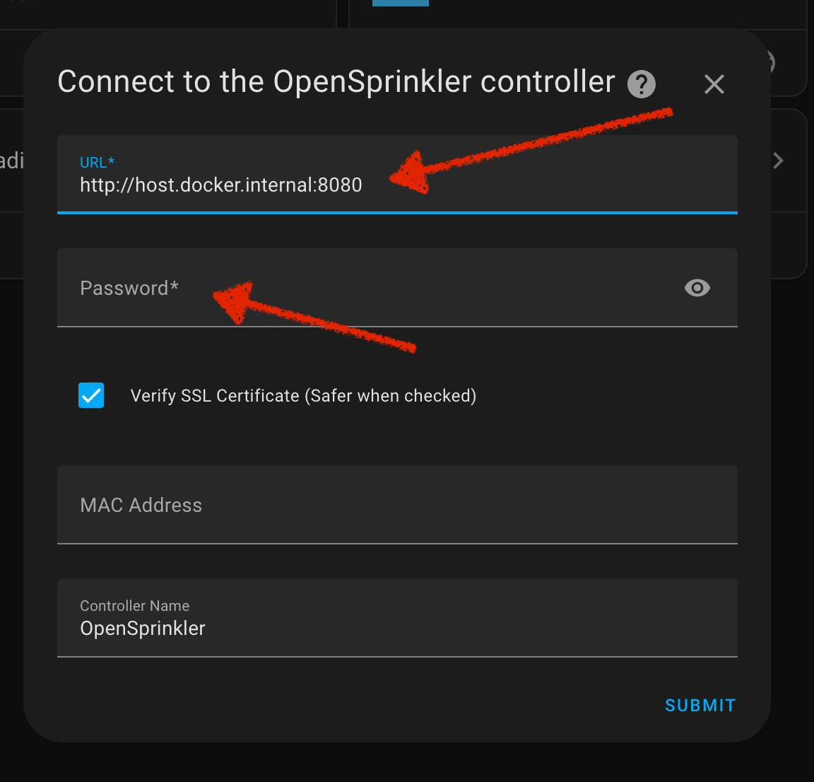

# CYD ESPHome + LVGL + OpenSprinkler

## Goal
Control your OpenSprinkler system using a cheap yellow display (CYD) by leveraging LVGL graphics with ESPHome and Home Assistant. This project integrates OpenSprinkler with Home Assistant using the OpenSprinkler integration, providing a visually appealing and user-friendly interface.

Watch the final result in action on [YouTube](https://youtu.be/lWU0q5RJe3E).

[](https://www.youtube.com/watch?v=lWU0q5RJe3E)

---

## Summary
This guide demonstrates how to:

1. Set up OpenSprinkler in a Docker container.
2. Configure Home Assistant to integrate with OpenSprinkler.
3. Use ESPHome to control a CYD display with LVGL widgets for sprinkler zone management.
4. Tweak configurations for different CYD hardware (e.g., micro-USB vs. USB-C models).

---

## Prerequisites

- Docker installed: [Docker Get Started Guide](https://docs.docker.com/get-started/)

---

## Step 1: OpenSprinkler Container Setup

1. **Build and run the OpenSprinkler Docker image:**

   ```bash
   cd opensprinkler && \
   docker build -t opensprinkler-demo .

   docker run -d \
     --name opensprinkler-demo \
     --restart unless-stopped \
     -p 8080:80 \
     opensprinkler-demo
   ```

2. **Access OpenSprinkler UI:**

   Open your browser and navigate to [http://localhost:8080](http://localhost:8080).

3. **Import the backup configuration:**

   Use the UI to import `backup-1-11-2025.json` from the `opensprinkler` folder.

   

Reference: [OpenSprinkler Firmware GitHub](https://github.com/OpenSprinkler/OpenSprinkler-Firmware.git)

---

## Step 2: Home Assistant Setup

1. **Run Home Assistant in Docker:**

   ```bash
   cd homeassistant && \
   docker run -d \
     --name homeassistant \
     --restart unless-stopped \
     -e TZ=America/New_York \
     -v "${PWD}":/config \
     -p 8123:8123 \
     ghcr.io/home-assistant/home-assistant:stable
   ```

2. **Access Home Assistant:**

   Open your browser and navigate to [http://localhost:8123](http://localhost:8123). Create an account if needed.

---

## Step 3: Add OpenSprinkler Integration

### 3.1 Install HACS

HACS (Home Assistant Community Store) is required for third-party integrations like OpenSprinkler.

```bash
cd homeassistant && \
wget -O - https://get.hacs.xyz | bash -
```

Optional: Add `input_boolean` entities for toggle switches by including `inputboolean.yaml` in `configuration.yaml`:

```bash
echo 'input_boolean: !include inputboolean.yaml' >> configuration.yaml
```

Make sure to restart Home Assistant to apply changes:

```bash
docker restart homeassistant
```

Follow the UI prompts to complete HACS setup.


### 3.2 Install OpenSprinkler Integration

1. Install the OpenSprinkler integration through HACS.


2. Use the following URL to access the controller, as shown in the image below.
   
   - **Controller URL:** `http://host.docker.internal:8080`
   - **Password:** Match the password used in the OpenSprinkler container.



---

## Step 4: ESPHome Setup

1. **Run ESPHome in Docker:**

   ```bash
   cd esphome && \
   docker run -d \
     --name esphome \
     --restart unless-stopped \
     -v "${PWD}":/config \
     -p 6052:6052 \
     esphome/esphome
   ```

2. **Generate Secrets:**

  Run the following script in order to set your WiFi information. Or, if you prefer, use `secrets.yaml.sample` as reference and create `secrets.yaml` manually.

   ```bash
   ./generate_secrets.sh
   ```

   Expected output:

   ```
   Enter your WiFi SSID (default: YourWiFiSSID): <SSID>
   Enter your WiFi Password (default: YourWiFiPassword): <WIFI_PASS>
   Generated secrets.yaml with random passwords.
   ```

3. **Adjusting CYD Configuration**

Depending on your CYD hardware (micro-USB or USB-C), adjust the `display` section in `cyd.yaml` as follows:

### For Micro-USB CYD:

```yaml
display:
  - id: main_display
    platform: ili9xxx
    model: ILI9341
    rotation: 0
    color_order: bgr
```

### For USB-C CYD:

```yaml
display:
  - id: main_display
    platform: ili9xxx
    model: ILI9342
    rotation: 90
    color_order: rgb
```

4. **Access ESPHome:**

   Open your browser and navigate to [http://localhost:6052](http://localhost:6052).

5. **Prepare ESPHome Firmware:**

   Use the ESPHome dashboard to build the initial firmware for your CYD device.

   
   
   
   
   

6. **Write Firmware:**

6.1 Build

   Use [web.esphome.io](https://web.esphome.io/) to flash the firmware onto the CYD device.

   

6.2 Write

   Connect device to USB port and install firmware just built in the previous step.

   
   
   
   
   

6.3 Collect Info on device

   From logs, find out the IP Address used by the device.

   
   

   Then, go back to the ESPHome link: [http://localhost:6052](http://localhost:6052).
   From there, obtain the the API key. You will be prompted for it when adding device to Home Assist.
   
   
   

7. **Add the Device to Home Assistant:**

   After flashing, go to Home Assistant and add the ESPHome integration. Follow the prompts to configure your CYD device.

   
   
   
   
   

8. **Allow the Device to perform Home Assistant actions:**

   Set the following option so the device can control OpenSprinkler:

   
   
   


---

## Images Directory

The `images` folder contains a wealth of screenshots illustrating each step in greater detail. If you're ever stuck or unsure, refer to these visuals to guide you.

[Browse the full images directory here](https://github.com/flavio-fernandes/cyd-esphome-lvgl-opensprinkler/tree/main/images)

---

## Using LVGL Widgets

Explore LVGL widgets in `cyd.yaml`. You can customize your interface further with:

- [LVGL Widgets Documentation](https://esphome.io/components/lvgl/widgets)
- [LVGL Cookbook](https://esphome.io/cookbook/lvgl)

---

## Useful Links

- [CYD](https://github.com/witnessmenow/ESP32-Cheap-Yellow-Display)
- [ESPHome examples](https://github.com/witnessmenow/ESP32-Cheap-Yellow-Display/tree/main/Examples/ESPHome)
- [ESPHome + LVGL on cheap touchscreen devices](https://github.com/RyanEwen/esphome-lvgl/tree/main)
- [ESPHome CYD Touchscreen](https://esphome.io/components/touchscreen/xpt2046.html)
- [ESPHome CYD Screen](https://esphome.io/components/display/ili9xxx.html#configuration-variables)
- [Program ESP boards from your browser](https://youtu.be/mj-24SZLQKk?si=YmQzyIjX29PfDJcj)
- [ESPHome now supports LVGL](https://youtu.be/8TuYq-6c5ok?si=Vt2xROMBBsuxwaMN)
